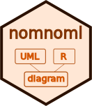

---
output:
  github_document:
    fig_width: 4
    fig_height: 1
---

```{r setup, include=FALSE}
library(nomnoml)
knitr::opts_chunk$set(eval = TRUE)
knitr::opts_chunk$set(fig.path = "man/figures/readme/", dev = "png")
```

# nomnoml 

<!-- badges: start -->
[](https://cran.r-project.org/package=nomnoml) <a href="https://www.r-pkg.org/pkg/nomnoml"></a>
[](https://github.com/rstudio/nomnoml/actions)
[](https://codecov.io/gh/rstudio/nomnoml?branch=master)
[](https://www.tidyverse.org/lifecycle/#experimental)
<!-- badges: end -->


**nomnoml** provides an R interface to [nomnoml](http://www.nomnoml.com/), a tool for drawing sassy UML diagrams based on syntax with customizable styling.

## Installation

Install from CRAN:

```{r eval=FALSE}
install.packages("nomnoml")
```

Or from GitHub using:

```r
install.packages("remotes")
remotes::install_github("rstudio/nomnoml")
```

## Getting Started

You can create your first diagram by running:

```{r eval=FALSE}
nomnoml::nomnoml("[Hello]-[World!]")
```


```{nomnoml nomnoml-simple, width="250px", height="75px", echo=FALSE}
[Hello]-[World!]
```

To make the diagram flow vertically, the default at [nomnoml.com](http://www.nomnoml.com/), add the [direction](https://github.com/rstudio/nomnoml/issues/5) directive:

```{nomnoml nomnoml-vertical, width="200px", height="200px", echo=TRUE}
#direction: down
[Hello]-[World!]
```

You can also use `nomnoml` in R Markdown:

````markdown
---
title: "A Diagram"
output: html_document
---

`r ''````{r, setup, include=FALSE}
library(nomnoml)
```

`r ''````{nomnoml}
#stroke: orange
#.box: fill=#8f8 dashed visual=ellipse

[A]-[B]
[B]-[<box>C]
```
````

```{nomnoml nomnoml-multiline, width="300px", height="100px", echo=FALSE}
#stroke: orange
#.highlight: fill=#8f8 dashed visual=ellipse

[A]-[B]
[B]-[<highlight>C]
```

### SVG

To render using SVG, add `svg = TRUE`


```{r, eval=FALSE}
nomnoml(diagram, svg = TRUE)
```


To render a `nomnoml` chunk in R Markdown, add `svg=TRUE` to the chunk options


````markdown
`r ''````{nomnoml, svg=TRUE}
#stroke: orange
#.box: fill=#8f8 dashed visual=ellipse

[A]-[B]
[B]-[<box>C]
```
````


```{nomnoml nomnoml-svg, width="400px", height="100px", svg=TRUE, echo=FALSE}
#stroke: orange
#.highlight: fill=#8f8 dashed visual=ellipse

[A]-[B]
[B]-[<highlight>C]
```


### Advanced

Notice that much more complex diagrams can be designed using 'nomnoml' by
combining association types, classifier types, directives and custom 
classifier styles.

```{nomnoml nomnoml-decorator, width="250px", height="250px"}
#stroke: #a86128
#direction: down
[<frame>Decorator pattern|
  [<abstract>Component||+ operation()]
  [Client] depends --> [Component]
  [Decorator|- next: Component]
  [Decorator] decorates -- [ConcreteComponent]
  [Component] <:- [Decorator]
  [Component] <:- [ConcreteComponent]
]
```

### Association types

    -    association
    ->   association
    <->  association
    -->  dependency
    <--> dependency
    -:>  generalization
    <:-  generalization
    --:> implementation
    <:-- implementation
    +-   composition
    +->  composition
    o-   aggregation
    o->  aggregation
    --   note
    -/-  hidden

### Classifier types

    [name]
    [<abstract> name]
    [<instance> name]
    [<reference> name]
    [<note> name]
    [<package> name]
    [<frame> name]
    [<database> name]
    [<start> name]
    [<end> name]
    [<state> name]
    [<choice> name]
    [<input> name]
    [<sender> name]
    [<receiver> name]
    [<transceiver> name]
    [<actor> name]
    [<usecase> name]
    [<label> name]
    [<hidden> name]

### Directives

    #arrowSize: 1
    #bendSize: 0.3
    #direction: down | right
    #gutter: 5
    #edgeMargin: 0
    #edges: hard | rounded
    #fill: #eee8d5; #fdf6e3
    #fillArrows: false
    #font: Calibri
    #fontSize: 12
    #leading: 1.25
    #lineWidth: 3
    #padding: 8
    #spacing: 40
    #stroke: #33322E
    #title: filename
    #zoom: 1

Directives only available when using the command line interface

    #import: my-common-styles.nomnoml

### Custom classifier styles

A directive that starts with "." define a classifier style.

    #.box: fill=#88ff88
    #.blob: fill=pink visual=ellipse italic bold dashed
    [<box> GreenBox]
    [<blob> HideousBlob]

Available visuals are

    visual=actor
    visual=class
    visual=database
    visual=ellipse
    visual=end
    visual=frame
    visual=hidden
    visual=input
    visual=none
    visual=note
    visual=package
    visual=receiver
    visual=rhomb
    visual=roundrect
    visual=sender
    visual=start
    visual=transceiver

Available modifiers are

    center
    bold
    underline
    italic
    dashed
    empty

## Contributing

Please refer to [github.com/skanaar/nomnoml](https://github.com/skanaar/nomnoml).
