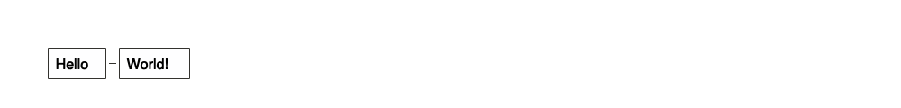
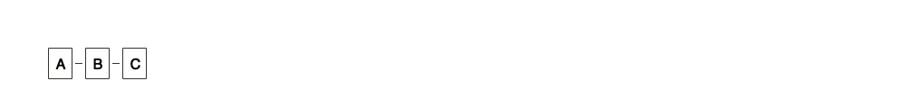
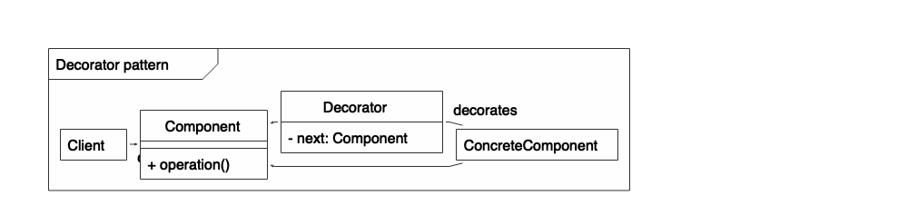

R Interface to ‘nomnoml’
================

**nomnoml** provides an R interface to
[nomnoml](http://www.nomnoml.com/), a tool for drawing sassy UML
diagrams based on syntax with customizable styling.

## Installation

Install from GitHub using:

``` r
devtools::install_github("javierluraschi/nomnoml")
```

## Getting Started

You can create your first diagram by running:

``` r
nomnoml::nomnoml("[Hello]-[World!]", height = 40)
```

<!-- -->

You can also use `nomnoml` as knitr chunks:

<pre><code>&#96``{r setup, include=FALSE}
library(nomnoml)
&#96``</code></pre>

<pre><code>&#96``{nomnoml height=40}
[A]-[B]
[B]-[C]
&#96``</code></pre>

<!-- -->

### Example

This is how the Decorator pattern looks like in nomnoml syntax:

``` nomnoml
[<frame>Decorator pattern|
  [<abstract>Component||+ operation()]
  [Client] depends --> [Component]
  [Decorator|- next: Component]
  [Decorator] decorates -- [ConcreteComponent]
  [Component] <:- [Decorator]
  [Component] <:- [ConcreteComponent]
]
```

<!-- -->

### Association types

    -    association
    ->   association
    <->  association
    -->  dependency
    <--> dependency
    -:>  generalization
    <:-  generalization
    --:> implementation
    <:-- implementation
    +-   composition
    +->  composition
    o-   aggregation
    o->  aggregation
    --   note
    -/-  hidden

### Classifier types

    [name]
    [<abstract> name]
    [<instance> name]
    [<reference> name]
    [<note> name]
    [<package> name]
    [<frame> name]
    [<database> name]
    [<start> name]
    [<end> name]
    [<state> name]
    [<choice> name]
    [<input> name]
    [<sender> name]
    [<receiver> name]
    [<transceiver> name]
    [<actor> name]
    [<usecase> name]
    [<label> name]
    [<hidden> name]

### Directives

    #arrowSize: 1
    #bendSize: 0.3
    #direction: down | right
    #gutter: 5
    #edgeMargin: 0
    #edges: hard | rounded
    #fill: #eee8d5; #fdf6e3
    #fillArrows: false
    #font: Calibri
    #fontSize: 12
    #leading: 1.25
    #lineWidth: 3
    #padding: 8
    #spacing: 40
    #stroke: #33322E
    #title: filename
    #zoom: 1

Directives only available when using the command line interface

    #import: my-common-styles.nomnoml

### Custom classifier styles

A directive that starts with “.” define a classifier style.

    #.box: fill=#88ff88
    #.blob: fill=pink visual=ellipse italic bold dashed
    [<box> GreenBox]
    [<blob> HideousBlob]

Available visuals are

    visual=actor
    visual=class
    visual=database
    visual=ellipse
    visual=end
    visual=frame
    visual=hidden
    visual=input
    visual=none
    visual=note
    visual=package
    visual=receiver
    visual=rhomb
    visual=roundrect
    visual=sender
    visual=start
    visual=transceiver

Available modifiers are

    center
    bold
    underline
    italic
    dashed
    empty

## Contributing

Please reffer to
[github.com/skanaar/nomnoml](https://github.com/skanaar/nomnoml).
